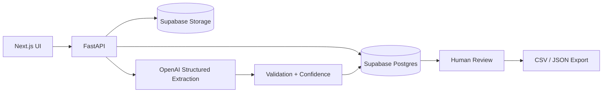

# InvoiceIQ from code

InvoiceIQ from code converts unstructured invoice PDFs into structured, validated data using AI. Each extracted field receives a confidence score, while low-confidence or invalid fields are automatically routed for human review before export.


## Architecture



The browser never communicates directly with Supabase. All storage and database operations go through the FastAPI service.

## Tech Stack

* **Frontend:** Next.js
* **Backend:** FastAPI / Python
* **Database:** Supabase Postgres
* **Storage:** Supabase Storage
* **AI:** OpenAI Structured Outputs
* **OCR:** Tesseract (optional)
* **Export:** CSV / JSON

### Invoice Status

```text
uploaded
   ↓
processing
   ↓
needs_review ──→ approved
                    ↓
                 exported
```

## 🔌 API

| Method | Endpoint                      | Purpose               |
| ------ | ----------------------------- | --------------------- |
| `POST` | `/documents`                  | Upload invoice PDF    |
| `GET`  | `/documents/{id}`             | Get document metadata |
| `POST` | `/documents/{id}/extract`     | Run AI extraction     |
| `GET`  | `/documents/{id}/fields`      | Get extracted fields  |
| `POST` | `/documents/{id}/review`      | Review / approve      |
| `GET`  | `/documents/{id}/export.csv`  | Export CSV            |
| `GET`  | `/documents/{id}/export.json` | Export JSON           |
| `GET`  | `/documents/{id}/file`        | Get signed file URL   |
| `GET`  | `/documents/{id}/file.pdf`    | Stream PDF            |

## Security

* Supabase service-role key is **server-side only**
* Invoice storage bucket is **private**
* Browser never accesses Supabase Storage directly
* Files are served through FastAPI
* RLS is enabled with no public policies

## Setup

### Requirements

* Python 3.11+
* Node.js 20+
* Supabase project
* OpenAI API key
* Tesseract OCR *(optional)*

### 1. Clone

```bash
git clone <repo-url>
cd invoiceiq-from-code
```

### 2. Configure Supabase

Create a Supabase project and run:

```text
supabase/migrations/001_init.sql
```

Create a **private** Storage bucket named:

```text
invoices
```

### 3. Configure API

```bash
cp .env.example apps/api/.env
```

Set:

```env
SUPABASE_URL=
SUPABASE_SERVICE_ROLE_KEY=
SUPABASE_STORAGE_BUCKET=invoices
OPENAI_API_KEY=
OPENAI_MODEL=
API_CORS_ORIGINS=
CONFIDENCE_THRESHOLD=0.8
```

### 4. Run API

```bash
cd apps/api

python3 -m venv .venv
source .venv/bin/activate

pip install -r requirements.txt

uvicorn main:app --reload --host 0.0.0.0 --port 8000
```

API:

```text
http://localhost:8000
```

Swagger:

```text
http://localhost:8000/docs
```

### 5. Run Web App

```bash
cd apps/web

npm install
npm run dev
```

Open:

```text
http://localhost:3000
```

### 6. Generate Sample Invoices

```bash
source apps/api/.venv/bin/activate
python apps/api/scripts/generate_samples.py
```

## Limitations

InvoiceIQ from code v0.1 is a local portfolio demo:

* Synthetic invoice data only
* Single-user
* No authentication
* No multi-tenancy
* No dashboard
* Confidence scores are heuristic
* No cloud deployment
* No Google Sheets integration

## License

Private portfolio project. No license file currently provided.

